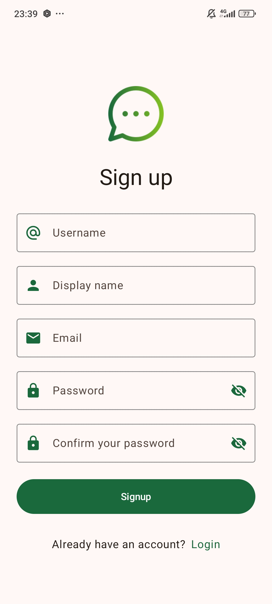

# Ứng dụng Messenger [Messenger]

Một ứng dụng nhắn tin Android hiện đại được xây dựng bằng Jetpack Compose, kiến trúc MVVM và Clean Architecture, cùng các dịch vụ Firebase, cho phép người dùng giao tiếp trong thời gian thực.

## Mục lục

- [Tổng quan](#tổng-quan)
- [Hình ảnh/Demo](#hình-ảnhdemo)
- [Tính năng chính](#tính-năng-chính)
- [Kiến trúc](#kiến-trúc)
    - [Clean Architecture Layers](#clean-architecture-layers)
    - [MVVM trong Presentation Layer](#mvvm-trong-presentation-layer)
    - [Luồng Dữ liệu (Data Flow)](#luồng-dữ-liệu-data-flow)
- [Công nghệ sử dụng](#công-nghệ-sử-dụng)
- [Yêu cầu cài đặt](#yêu-cầu-cài-đặt)
- [Hướng dẫn cài đặt](#hướng-dẫn-cài-đặt)
    - [Firebase Setup](#firebase-setup)
- [Cách chạy ứng dụng](#cách-chạy-ứng-dụng)
- [Cấu trúc thư mục](#cấu-trúc-thư-mục)
- [Tác giả](#tác-giả)
- [Giấy phép](#giấy-phép)

## Tổng quan

Dự án này là một ứng dụng nhắn tin đa tính năng, được phát triển nhằm mục đích học tập và trình diễn khả năng của Jetpack Compose trong việc xây dựng giao diện người dùng động. Dự án áp dụng **Clean Architecture** để tách biệt các mối quan tâm (separation of concerns), tăng khả năng kiểm thử (testability) và dễ dàng bảo trì. Mẫu thiết kế **MVVM (Model-View-ViewModel)** được sử dụng trong tầng Presentation để quản lý trạng thái UI và logic một cách hiệu quả. Hệ sinh thái Firebase được tận dụng cho backend, bao gồm xác thực, cơ sở dữ liệu thời gian thực, lưu trữ file và thông báo đẩy.

## Hình ảnh/Demo

*(Thêm ảnh chụp màn hình hoặc GIF demo của ứng dụng tại đây)*

**Ví dụ:**

|                 Màn hình Đăng nhập                  |                  Màn hình Đăng ký                  | Màn hình Danh sách bạn bè |
|:---------------------------------------------------:|:--------------------------------------------------:|:-------------------------:|
|  |  |           [...]           |

*(Bạn có thể nhúng ảnh trực tiếp vào file README hoặc tạo một thư mục `screenshots` trong repo)*

## Tính năng chính

- [x] **Xác thực người dùng:** Đăng ký, đăng nhập, đăng xuất bằng Firebase Authentication (Email/Password, Google Sign-In, etc.).
- [ ] **Nhắn tin thời gian thực:** Gửi và nhận tin nhắn văn bản, hình ảnh với Firestore.
- [ ] **Thông báo đẩy (Push Notifications):** Nhận thông báo tin nhắn mới ngay cả khi ứng dụng không mở, sử dụng Firebase Cloud Messaging (FCM) và Cloud Functions để xử lý logic gửi thông báo.
- [ ] **Gửi hình ảnh:** Người dùng có thể gửi hình ảnh, được lưu trữ trên Firebase Storage.
- [ ] **Danh sách cuộc trò chuyện:** Hiển thị danh sách các cuộc trò chuyện gần đây.
- [ ] **Trạng thái người dùng:** (Tùy chọn) Hiển thị trạng thái online/offline.
- [ ] **Tìm kiếm người dùng:** (Tùy chọn) Cho phép tìm kiếm và bắt đầu cuộc trò chuyện mới.
- [ ] **Giao diện người dùng hiện đại:** Xây dựng hoàn toàn bằng Jetpack Compose.
- [ ] **Cập nhật hồ sơ người dùng:** (Tùy chọn) Cho phép người dùng cập nhật ảnh đại diện, tên hiển thị.

## Kiến trúc

Dự án này tuân theo các nguyên tắc của **Clean Architecture** kết hợp với mẫu **MVVM** trong tầng Presentation.

### Clean Architecture Layers

Kiến trúc được chia thành ba tầng chính:

1.  **Presentation Layer (Lớp Trình bày):**
    * Chịu trách nhiệm hiển thị giao diện người dùng (UI) và xử lý tương tác từ người dùng.
    * Bao gồm các **Views/Screens** (Composable functions trong Jetpack Compose), **Navigation**, **Components**(Các UI components tái sử dụng), **UI Theme** và **ViewModels** (theo mẫu MVVM).
    * ViewModels nhận dữ liệu từ Domain Layer (thông qua Use Cases) và chuẩn bị dữ liệu đó để hiển thị trên UI.
    * Không chứa logic nghiệp vụ phức tạp.

2.  **Domain Layer (Lớp Nghiệp vụ):**
    * Là trái tim của ứng dụng, chứa toàn bộ logic nghiệp vụ (business logic).
    * Bao gồm các **Use Cases** (hoặc Interactors), **Data Source interface** (Remote và Local),  **Model(Entities)** (các đối tượng nghiệp vụ cốt lõi), và các **Repository Interfaces** (định nghĩa hợp đồng cho việc truy cập dữ liệu).
    * Tầng này hoàn toàn độc lập với các chi tiết triển khai của UI hay cơ sở dữ liệu. Nó không phụ thuộc vào Android framework.

3.  **Data Layer (Lớp Dữ liệu):**
    * Chịu trách nhiệm triển khai các Repository Interfaces từ Domain Layer.
    * Quản lý việc lấy dữ liệu từ các nguồn khác nhau (ví dụ: Firebase Firestore, Firebase Storage, API từ xa, cơ sở dữ liệu cục bộ).
    * Bao gồm các **Repository Implementations**, **Data Sources** (Remote và Local), **Model (Data Transfer Objects)** (Request và Response), và **Mappers** (để chuyển đổi giữa các mô hình dữ liệu của Data Layer và Domain Layer).

### MVVM trong Presentation Layer

-   **View (Composable Screens):** Quan sát (observe) dữ liệu từ ViewModel và hiển thị lên giao diện. Gửi các sự kiện tương tác của người dùng tới ViewModel.
-   **ViewModel:** Chứa logic liên quan đến UI, quản lý trạng thái (state) của UI. Gọi các Use Cases từ Domain Layer để thực hiện các hành động nghiệp vụ và nhận kết quả. ViewModel không có tham chiếu trực tiếp đến View (Composable functions).
-   **Model:** Trong ngữ cảnh MVVM và Clean Architecture, Model thường là các Entities từ Domain Layer hoặc các UI-specific models được ViewModel chuẩn bị.

### Luồng Dữ liệu (Data Flow)

Luồng dữ liệu điển hình trong ứng dụng:

`UI (Compose Screen) -> ViewModel -> Use Case (Domain) -> Repository (Data) -> Data Source (Firebase)`

Và ngược lại:

`Data Source (Firebase) -> Repository (Data) -> Use Case (Domain) -> ViewModel -> UI (Compose Screen)`

## Công nghệ sử dụng

- **Kiến trúc & Mẫu thiết kế:**
    - [Clean Architecture](https://blog.cleancoder.com/uncle-bob/2012/08/13/the-clean-architecture.html)
    - [MVVM (Model-View-ViewModel)](https://developer.android.com/topic/architecture#mvvm)
- **Giao diện người dùng (UI):**
    - [Jetpack Compose](https://developer.android.com/jetpack/compose): Bộ công cụ UI hiện đại để xây dựng giao diện người dùng gốc cho Android.
    - [Material Design 3](https://m3.material.io/): Hướng dẫn thiết kế và thư viện component.
- **Backend & Cơ sở dữ liệu:**
    - [Firebase Firestore](https://firebase.google.com/docs/firestore): Cơ sở dữ liệu NoSQL.
    - [Firebase Authentication](https://firebase.google.com/docs/auth): Dịch vụ xác thực người dùng.
    - [Firebase Storage](https://firebase.google.com/docs/storage): Lưu trữ file.
    - [Firebase Cloud Messaging (FCM)](https://firebase.google.com/docs/cloud-messaging): Thông báo đẩy.
    - [Firebase Cloud Functions](https://firebase.google.com/docs/functions): Logic backend serverless.
- **Ngôn ngữ lập trình:**
    - [Kotlin](https://kotlinlang.org/): Ngôn ngữ lập trình chính thức cho phát triển Android.
- **Lập trình bất đồng bộ:**
    - [Kotlin Coroutines](https://kotlinlang.org/docs/coroutines-overview.html): Cho các tác vụ nền và quản lý luồng.
    - [Kotlin Flow](https://kotlinlang.org/docs/flow.html): Cho các luồng dữ liệu bất đồng bộ (thường dùng trong Repository và Use Cases để trả về dữ liệu cho ViewModel).
- **Dependency Injection:**
    - [Hilt](https://developer.android.com/training/dependency-injection/hilt-android) (hoặc Dagger 2): Để quản lý và cung cấp các phụ thuộc.
- **Navigation:**
    - [Navigation Compose](https://developer.android.com/jetpack/compose/navigation): Điều hướng giữa các màn hình Compose.

## Yêu cầu cài đặt

- Android Studio Iguana | 2023.2.1 trở lên (khuyến nghị phiên bản mới nhất).
- JDK 17 trở lên.
- Tài khoản Firebase.

## Hướng dẫn cài đặt

1.  **Clone repository:**
    ```bash
    git clone [https://github.com/](https://github.com/)[Tên tài khoản Git của bạn]/[Tên repository của bạn].git
    cd [Tên repository của bạn]
    ```

2.  **Mở dự án bằng Android Studio.**

3.  **Firebase Setup:**
    * Truy cập [Firebase Console](https://console.firebase.google.com/).
    * Tạo một dự án Firebase mới (hoặc chọn một dự án đã có).
    * Thêm một ứng dụng Android vào dự án Firebase của bạn:
        * Nhập **Package Name** của ứng dụng (thường là `applicationId` trong file `app/build.gradle.kts`).
        * (Tùy chọn) Nhập Nickname và SHA-1 debug signing certificate.
    * Tải xuống file `google-services.json`.
    * Sao chép file `google-services.json` vừa tải về vào thư mục `app/` của dự án Android.
    * **Kích hoạt các dịch vụ Firebase cần thiết:**
        * **Authentication:** Kích hoạt các phương thức đăng nhập (ví dụ: Email/Password, Google).
        * **Firestore Database:** Tạo database, bắt đầu ở chế độ test hoặc production với quy tắc bảo mật ban đầu.
            * **Quy tắc bảo mật (Security Rules) cho Firestore (Ví dụ cơ bản - cần tùy chỉnh):**
              ```
              rules_version = '2';
              service cloud.firestore {
                match /databases/{database}/documents {
                  match /users/{userId} {
                    allow read, write: if request.auth != null && request.auth.uid == userId;
                  }
                  match /conversations/{conversationId} {
                    // Chỉ những người tham gia cuộc trò chuyện mới có quyền truy cập
                    allow read, write: if request.auth != null && resource.data.participants.hasAny([request.auth.uid]);
                  }
                  match /conversations/{conversationId}/messages/{messageId} {
                    allow read, write: if request.auth != null && get(/databases/$(database)/documents/conversations/$(conversationId)).data.participants.hasAny([request.auth.uid]);
                  }
                }
              }
              ```
        * **Storage:** Kích hoạt Storage.
            * **Quy tắc bảo mật (Security Rules) cho Storage (Ví dụ cơ bản - cần tùy chỉnh):**
              ```
              rules_version = '2';
              service firebase.storage {
                match /b/{bucket}/o {
                  match /profile_images/{userId}/{allPaths=**} {
                    allow read;
                    allow write: if request.auth != null && request.auth.uid == userId;
                  }
                  match /chat_images/{conversationId}/{allPaths=**} {
                    // Cần logic phức tạp hơn, ví dụ dựa trên thành viên cuộc trò chuyện
                    allow read, write: if request.auth != null;
                  }
                }
              }
              ```
        * **Cloud Functions (Nếu bạn tự viết):** Cài đặt Firebase CLI và deploy functions.
        * **Cloud Messaging:** Thường được kích hoạt mặc định.

4.  **Đồng bộ dự án (Sync Project with Gradle Files) trong Android Studio.**

## Cách chạy ứng dụng

1.  Kết nối thiết bị Android thật hoặc khởi động một Emulator (API 26 trở lên).
2.  Chọn cấu hình chạy (run configuration) là `app`.
3.  Nhấn nút "Run" (▶️) trong Android Studio.

## Cấu trúc thư mục

Cấu trúc thư mục được tổ chức theo các tầng của Clean Architecture:

app/
├── src/
│   ├── main/
│   │   ├── java/
│   │   │   └── pro/branium/messenger/
│   │   │       ├── MainActivity.kt
│   │   │       ├── app/                       # Chứa lớp Application của dự án
│   │   │       ├── data/ # Data Layer
│   │   │       │   ├── datasource/
│   │   │       │   │   ├── local/              # (Tùy chọn) Local Data Sources (Room DB)
│   │   │       │   │   └── remote/             # Remote Data Sources (Firebase, Retrofit)
│   │   │       │   ├── mapper/                 # Mappers chuyển đổi DTOs sang Entities và ngược lại
│   │   │       │   ├── model/                  # Data Transfer Objects (DTOs) cho Data Layer
│   │   │       │   │   ├── request/            # Các DTO cho Request
│   │   │       │   │   └── response/           # Các DTO cho Response
│   │   │       │   └── repository/             # Repository Implementations
│   │   │       ├── domain/ # Domain Layer
│   │   │       │   ├── model/                  
│   │   │       │   │   ├── entities/           # Entities (Đối tượng nghiệp vụ cốt lõi)
│   │   │       │   │   ├── errors/             # Các lỗi (exceptions) khi xử lý dữ liệu
│   │   │       │   │   └── enums/              # Các enum trong Domain Layer
│   │   │       │   ├── repository/             # Repository Interfaces (Hợp đồng)
│   │   │       │   ├── usecase/                # Use Cases (Logic nghiệp vụ)
│   │   │       │   └── datasource/             # Data Sources Interfaces (Remote và Local)
│   │   │       ├── presentation/ # Presentation Layer
│   │   │       │   ├── screens/                # Các màn hình (LoginScreen, ChatScreen, HomeScreen, etc.)
│   │   │       │   ├── components/             # Các UI components tái sử dụng
│   │   │       │   ├── navigation/             # Logic điều hướng (Navigation Compose)
│   │   │       │   ├── ui/
│   │   │       │   │   └── theme/              # Theme, Colors, Typography
│   │   │       │   └── viewmodel/              # ViewModels
│   │   │       ├── di/                         # Dependency Injection (Hilt modules)
│   │   │       ├── utils/                      # Utilities, Constants, ...
│   │   │       ├── service/                    # Firebase Messaging Service
│   │   ├── res/
│   │   └── AndroidManifest.xml
│   └── google-services.json
├── build.gradle.kts

## Tác giả

- **[Tên của bạn]** - [emailcuaban@example.com] - [Link GitHub của bạn]
- (Thêm các thành viên khác nếu có)

## Giấy phép

Dự án này được cấp phép theo Giấy phép MIT - xem file [LICENSE.md](LICENSE.md) (nếu bạn tạo file này) để biết chi tiết.